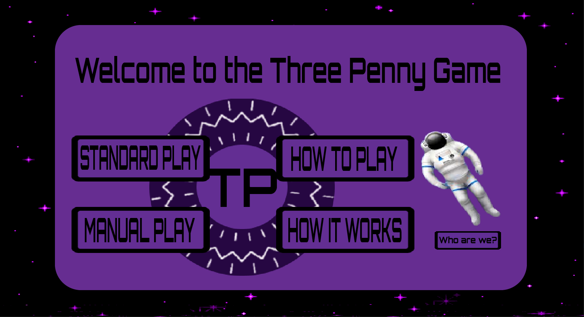

# Three Pennies Group Project 

## A game about probability

### Description:
Group project for cs4500, a small game made in Java with Swing 

### Group Members:

* Avery Johnson
* Divine Akinjiyan
* Joshua Lanctot
* Nick Cherry
* Harris Bihorac


<br>



<br>

> The jar file is located in the target directory.

 
 - - -


To compile and build jar from scratch in Intellij IDE:
```
click on maven sidebar
click on clean
click on install
```


*Note: If compiling/building program causes problems or assets are missing, confirm that
* main/java is marked as sources directory
* test/java is marked as test directory
* pom.xml is marked as maven project
* assets is marked as resources directory


